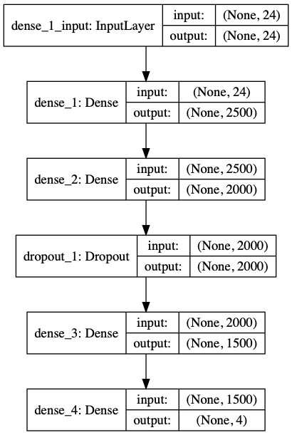
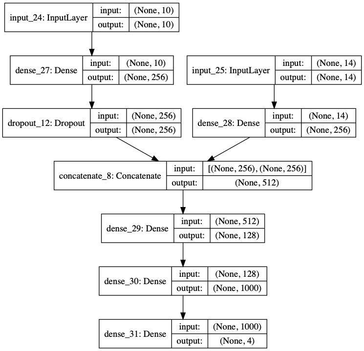

This is the reposository for Thomas Tarler's practicuum 2 in reinforcement learning. 

**Directory**
1. Final Report: Latex documents with final results.
2. : (**Note to instructor:**) Use this PDF when evaluating writeup, as the ```ReadMe.MD``` is rather sparse 
3. scripts: Scripts that can be run on a Python cluster to determine final results

**Final Neural Networks:**
1. 


2. DDPG Architecture
    a. 
    b. 
    c. 
    d. 

**To Run Scripts**
1. Zip and upload `DDPG` or `DQN` to the multiprocessing cluster of your choice. Must have the following:
    a. `anaconda3` with  `keras-rl`, `box2d` installed
    b. If you want to render, ensure that `ffmpeg` (use `brew`, `yum`, or `apt` depending on server)
    c. Tensorflow 1.0 compatability installed
2. For DQN, run `python DQN_BipedalWalker.py`, no command line arguments are necessary. If you do not have rendering established, put `n` when prompted. 
3. For DDPG, run `python ddpg_batch.py EPISODES BATCH_SIZE LSTM ARG EPC`. Again, select `n` for rendering. Command line arguments are:
    a. `EPISODES` in integer is number of episodes (I ran 10000)
    b. `BATCH_SIZE`in integer is the batch size (typically 16-32)
    c. `LSTM` is a boolean, depending if you want to call a LSTM network for the recall buffer
    d. `ARG` in integer is how often you want training results displayed via CLI
    e. `EPC` in integer is how many epochs you want to use. 
